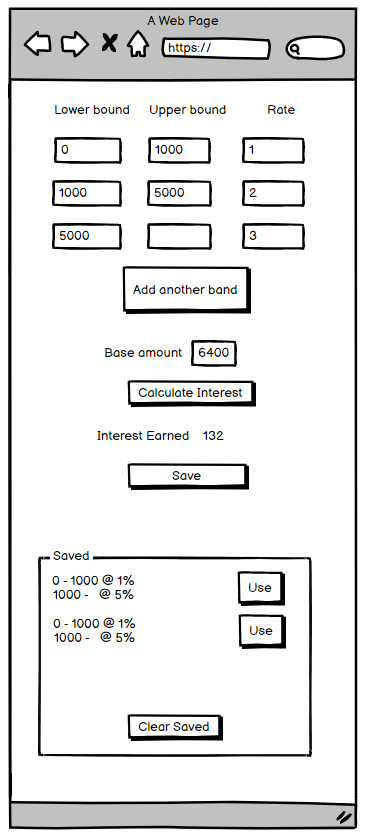

# interest

## Environment Assumptions

* Java 8
* Springboot 2.3.1, jar packaging
* Gradle 6.4

## Non-functional Assumptions

* All components running locally, single user mode
* No need to distinguish users
* No security requirements (http, mongo credentials stored in a local config file)
* No need for i81n / l10n / a11y

## Functional Assumptions

* Currency used will be GBP / USD like (whole units, 100 subunits), but not declared as any specific currency
* Interest rates can be positive, zero, and negative integers
* The first interest rate band must start at zero
* The last interest rate band may have no upper bound, in which case it applies any amount above the upper bound, to Long.MAX_VALUE. If it does have an upper bound, any money above that accrues no interest.
* There can be no gaps or overlaps in the interest rate bands
* The upper bound of a band must be greater than the lower bound

## Tools used

* Springboot Initializr
* Mongo

## Design

### Back End

* 3 Tier approach
  * REST controller
    * Submit values for calculation
    * Submit values for persisting
    * Retrieve all persisted values
    * Clear all persisted values (required for testing)
  * Business logic service
    * Public methods for the above
    * Private / protected methods as required
  * Data store repository
    * Methods as needed for persisting and retrieving
* Data Model
  * List of interest rate bands
    * eg 1000 (lower bound) to 5000 (upper bound) gains 2% (interest rate) 
  * Amounts of earned interest calculated  
  
### Front End

* Single Page
* 

## Plan of action

### Stage 1

* Bootstrap Spring Boot project
* Create project structure
* Add 3-tier skeleton
* Write tests for calculator
* Implement calculator to pass tests

### Stage 2

* Bootstrap React Project
* Implement UI and REST API access layer
* Connect frontend and backend projects
* Finish backend

### Stage 3

* Install and configure MongoDB
* Add persistence and retrieval
* Improve styling
* Finish frontend